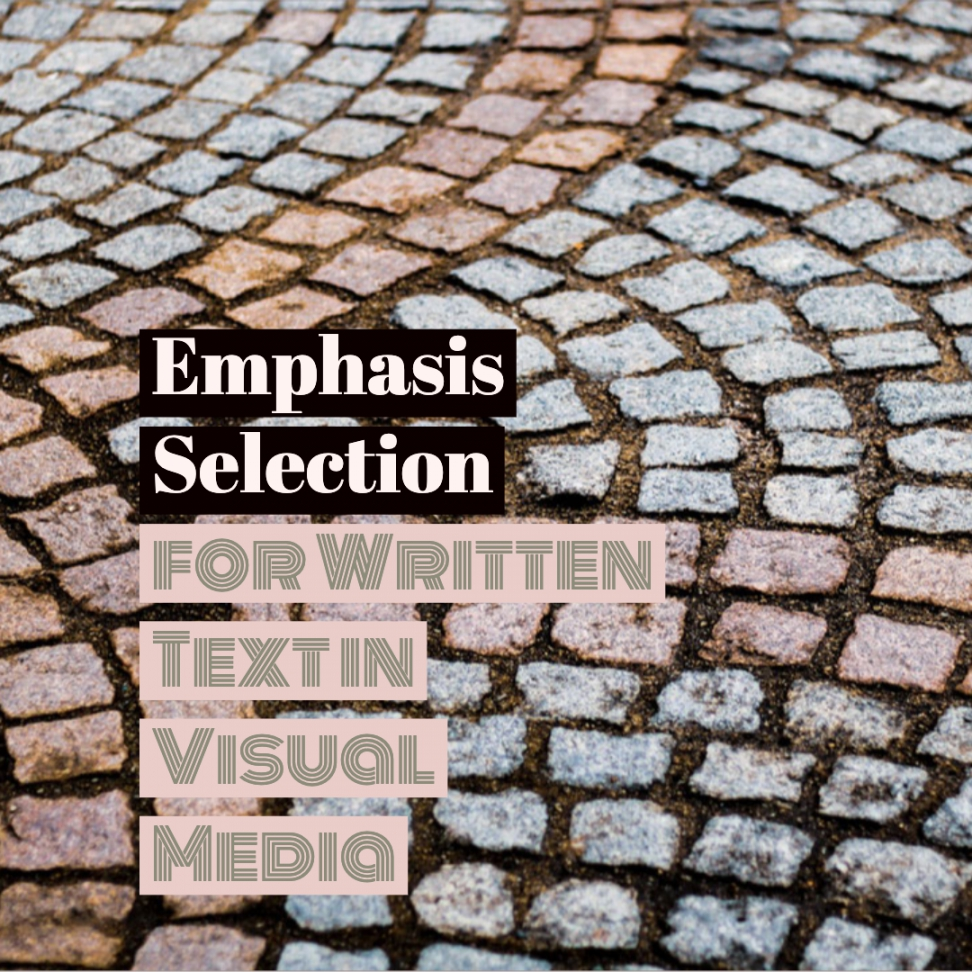

Github repository of "Learning Emphasis Selection for Written Text in Visual Media from 
Crowd-Sourced Label Distributions" ACL 2019. 

You can find the dataset here: http://ritual.uh.edu/resources/emphasis-2019/
